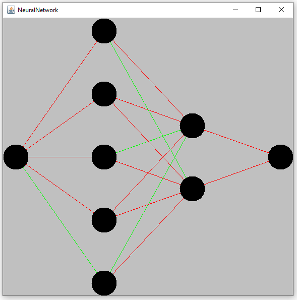

First, have a look at the NeuralNetwork4J-Repository  
for more details about the library used in this example  

Sample of the buildt in Plotter for NeuralNetworks:  

Developed by  
Thomas Hofmann  
Austria 2019
